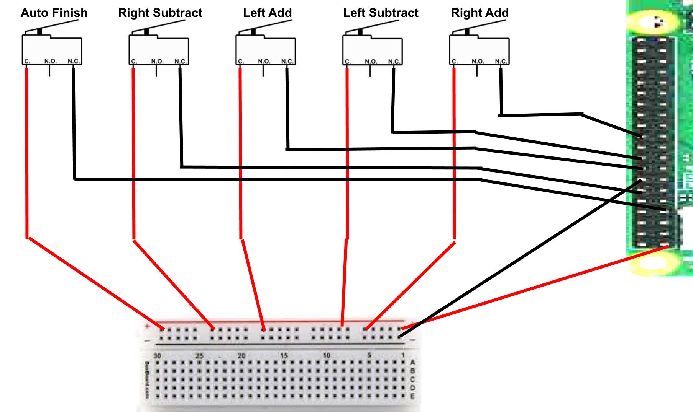

# ButtonStation

A GUI that will act as a scoreboard for a this or that questionnaire. It will be controlled by 5 buttons that are hooked up to a raspberry pi. The program will also pick a random end point and then resets itself with a new question.

---

## Set Up and Installation

### Software

1) `git clone https://github.com/CRahne/ButtonStation.git` into a desired directory on the PI.
2) You can tweak parts of the program in Constants.py or Questions.csv (more on that later)
3) [Install Python 3](https://www.python.org/downloads/). This will install the tkinter module, the used GUI framework.
3) Run [ButtonStation_v6.py](ButtonStation_v6.py), which is in the root directory

### Wiring

This is a diagram for the Raspberry PI model 4 with a 40 pin layout. You will also need to give it a power supply, a hdmi output, and connections to a USB mouse and keyboard.

---

## Configuration

### GUI (Window) Size

The settings for the size of the window are near the top of Constants.py. Changing these numbers will change the size of the 
window, but font size, the size of the image, and padding **will not** adjust to fit the new settings, and will have to be
adjusted manually using the padx, pady, and font size variables in Constants.py. To go full screen, get your monitor pixel dimensions/resolution.

### Questions

1) Change or Add questions in the Questions.csv file. An example would be, ```Favorite Animal?, Cat, Dog,```. Note the final comma at the end of the line, as that is important in the next step. Also, if you wanted different sets of questions, you can have multiple csv files.
2) Run [Question_Converter.py](Question_Converter.py). It will prompt for the filename that stores your questions in [Questions_converted.csv](Questions_converted.csv).
3) Change the GUI Constraints in [Constants.py](Constants.py).

### Center Photo

You will need to place the desired photo (which must be .png) into the root directory. Then, you must change the ```Photo_Image_File``` variable in [Constants.py](Constants.py). You may need to adjust other variables, such as padding, to account for the size of the photo.

### Changing Button GPIO Pins

The default pins of the buttons are stored in [Constants.py](Constants.py). They are as follows:

```python
L_Add = 23      # Adds One to the Left Count
R_Add = 25      # Adds One to the Right Count
L_Sub = 24      # Subtracts One from the Left Count
R_Sub = 18      # Subtracts One from the Right Count
Auto_Finish = 4 # Resets the Poll
```

To edit these, you simply need to change the value assigned to the variable.

### Colors

There are many variables in [Constants.py](Constants.py) that relate to this. All of the variables are strings that come standard with the Tkinter module. They can be found [here](https://www.tutorialspoint.com/python/tk_colors.htm).

---

## Files

### [ButtonFactory.py](ButtonFactory.py)
This file is used to set up the buttons and adds event catchers for each button.

### [Constants.py](Constants.py)
This file stores most of the variables used by the program. This keeps most of the values in one spot, making 
customizing the program much easier.

### [ButtonStation_v6.py](ButtonStation_v6.py)
This is where the majority of the logic takes place. All GUI setup, updates, and general control is done here.

### [logo.png](logo.png)
This is the default image to be displayed by the program.

### [Question_Converter.py](Question_Converter.py)
This program converts the questions in Questions.csv and stores the new questions in Questions_converted.csv. It
is only used by the programmer when adding or removing questions.

